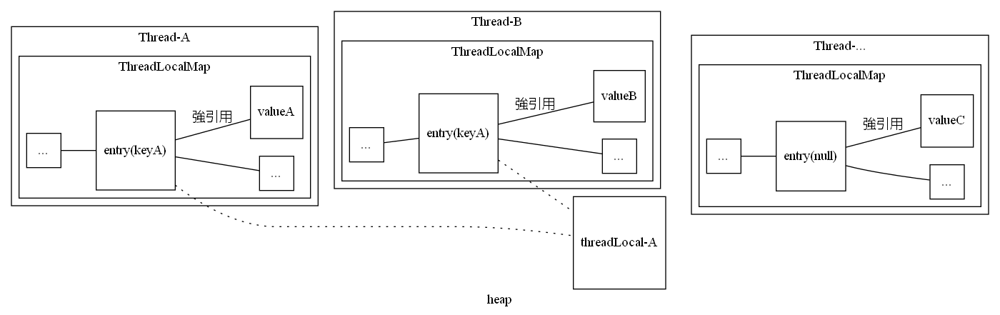

## ThreadLocal

### 一、ThreadLocalMap

#### Ⅰ、快速求索引   
ThreadLocalMap 要求容量 cap 為 2 的冪，cap-1 對應的二進制即爲 `0b0...011..1`, 當鍵的 `hashCode & (cap - 1)` 就只會獲得小於 cap 的低位值，從而映射到數組索引 0 ~ cap-1 上。

#### Ⅱ、Entry 
Entry 本身繼承了弱引用，實例化為 ThreadLocal 的弱引用類，整體充當 Map 中的 key，當垃圾回收發生時，對應的 key 會被回收變成 null。   
value 作爲 entry 的強引用實例，不會被垃圾回收，因此需要在合適的時候回收 value 所占的内存。

#### Ⅲ、實現方式     
該 map 使用開放定址法實現。  
+ 使用循環數組存儲數據，要保證數組容量不使用完，否則後續遍歷進入死循環；
+ 插入數據：計算出索引位置 index 為空，則直接插入，否則向 index + 1 的位置遍歷尋找為空位置插入；
+ 刪除數據：計算出索引位置 index，刪除該位置數據，然後向後遍歷，刪除 key 相同的或者 key 為 null 的數據，直到數組對應位置為 null。

#### Ⅳ、table 擴容 --> resize()  
初始容量為 16，每次擴容都以 2 的冪形式將容量擴大一倍。然後將舊表數據移動到新表，此時順帶清除被垃圾回收的 key 對應的 entry，將其 value 設爲 null 即可，解除強引用。     

#### Ⅴ、内存回收     
+ getEntryAfterMiss：當 key 對應索引位置的 entry 獲得的 key 為 null，則回收該位置内存；   
+ set：
    + 當待插入的 key 對應索引位置的 entry 獲得的 key 為 null，則取代該位置上的 entry；
    + 插入完成，以對數形式盡量釋放可能為 null key 的 entry；   
    + size 超過 threshold 進行 rehash，全量掃描 table，尋找 key 為 null 的 entry 進行釋放。
+ remove：直接釋放 key 對應索引位置的 entry。

### 二、ThreadLocal 設計    
    

每個綫程都維護了一份自身作用域的局部變量，在綫程生命周期内可以進行訪問。如上圖所示，該變量為 ThreadLocalMap 實例。每一個外部定義的 ThreadLocal，都具有唯一的哈希碼 `threadLocalHashCode`，代表用戶保存的變量在 ThreadLocalMap 中的索引。  ThreadLocal 每次操作總要先獲得當前綫程，然後根據綫程内的 ThreadLocalMap 去操作對應的數據。   

在垃圾回收時，某個 threadLocal 實例通過可達性分析不存在引用，則需要對其回收。但綫程中 threadLocalMap 中對 threadLocal 的引用不可能在綫程生命周期内通過代碼主動斷開，此時該實例造成了内存泄漏。但是 entry 和 threadLocal 實例閒的弱引用（圖中虛綫）就可以在垃圾回收時斷開回收 threadLocal，key 變爲 null，此時該 entry 失效，不過 entry 還存在，仍然具有對 value 的強引用，因此需要在後續操作中移除數據。

以上也就是説長生命周期對象（綫程實例）持有短生命周期對象（threadLocal 實例）時，短生命周期對象被銷毀，長生命周期對象仍然具有副作用（對 value 的強引用），需要進一步對内存進行處理，否則有可能造成内存泄漏。

一個可能的場景即爲綫程池，其中的綫程存活時間很長，執行很多任務，每個任務會創建 threadLocal，其生命周期同任務的周期，當任務被銷毀，threadLocal 被銷毀，但是執行該任務的綫程沒有被銷毀，仍然保留了對任務創建 value 的強引用。

#### Ⅰ、get   
當綫程局部 ThreadLocalMap 存在且能找到索引，那就返回對應值，否則調用 initialValue 獲得值。

#### Ⅱ、set    
1. 如果 key 對應的索引位置已經被其他 key 占據，則向後尋找位置；
2. 如果 key 對應的索引位置沒有被垃圾回收，則替換 value；
3. 對應位置垃圾回收了，代表該位置的 key 爲空，而 entry 不爲空，則取代對應的 entry；
4. 對應索引位置為 null，則在該位置新增一個 entry；

最後清除失效的（即被垃圾回收） key，如果 size 超過了 threshold，則增大空間。

#### Ⅲ、remove    
刪除當前綫程中 key 對應位置的數據。
